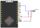

# EmSys_Lab3

In Lab 3, you get to design a low-powered wireless temperature sensor network node.     
You will configure your TinyPico device to read data from a DS18B20 temperature sensor, collect the data, average the data, and then send it to the central server, where the server will render it on a web page. 
__This project aims to make your device consume as little power as possible, so it can last off a battery for as long as possible when deployed in the field.__

### Bugs and workarounds

* In the current version of LetESP32.h there is a call to ```Serial.begin(115200)`` that was accidentally left in for debugging purposes. This means that calling ``Serial.begin()`` in your ``setup()`` can cause some issues. If you are using the LetESP32.h library then it is fine to call ``Serial.print()`` without calling ``Serial.begin()``.

### Logbook

Similarly to Lab 2, we will use the logbook from Lab 1 for Lab 3. Please do the following to your current git logbook repository:

* Make a directory called ``Lab3/`` in the root directory of your repository
* Make a file ``Lab3/README.md``. This file is where you will write about your experiments and results
* Make a directory ``Lab3/src``. This directory will contain the source code for your various experiments; it is up to you to keep this directory organised and use it to support what you write in ``Lab3/README.md``
* Make a file ``Lab3/CONTRIBUTIONS.md`` that outlines what each member of the group contributed to the logbook.

### Marking and overall structure
This lab is more open than the previous labs. You first need to develop a working temperature sensor that sends data in a format that the web server can understand. After that, you will perform your experiments to optimise the power consumption of your device. The marks are roughly split like this:

* __[40%]__ for getting a primary temperature sensor working without any consideration to power consumption   
* __[60%]__ for investigating power consumption and performing power saving experiments

Not all of your power saving design experiments will work out, but I want to see evidence that you have thought about things and experimented in the report. It is more the process of testing and trying things that I will mark. Remember that I am _always_ more than happy to chat 1-on-1 or in your groups to discuss your ideas. 

## What the central lab server is expecting

Your TinyPico will communicate with the central lab server to periodically send it data that it has collected from a temperature sensor.
                                                                                                        The server is expecting a payload of temperature data once every 30 seconds. Each payload will contain the following information:

* Your `dotDevice` ID
* 16 temperature measurements, with relative timestamps, taken over a 30-second window
* An average ([arithmetic mean](https://en.wikipedia.org/wiki/Arithmetic_mean)) of those 16 temperature measurements

The server expects this payload to be in either one of two formats: a JSON format (like what we used in Lab 1 for the dotDevice commands); or a more efficient binary protocol. These protocols are outlined in section __Data transfer protocol formats__.
                                                                                                        Your device must take 16 readings in a 30-second window, and __must__ transmit to the server a payload of temperature data _precisely every_ 30 seconds. The server will track these payloads' delivery, and an indicator will show if payloads are arriving too frequently or infrequently.

The actual measurements within the 30-second window can be spaced however you like. You could, for instance, capture them all as fast as possible at the start of the 30 seconds or space them out evenly over the entire 30 seconds. The choice is yours, but the timestamps associated with each reading must be accurate.

## The temperature sensor


The DS18B20 datasheet can be found [[here](https://datasheets.maximintegrated.com/en/ds/DS18B20.pdf)].

This sensor is a one-wire sensor, meaning that we can use a single data pin to communicate with it. Don't worry; some libraries are provided to make this a bit easier, and if you do some googling, there are plenty of tutorials online detailing how to use this with ESP32s.

The ESP32 and DS18B20s are currently connected in the lab as follows:



* The data line (blue) is connected to GPIO pin 26.
* The power line (red) is connected to the 3.3v output.
* The GND line (black) is connected to the GND pin on the TinyPico.
* A 4.7KOhm pull-up resistor is connected between the data line and the power line.

This wiring setup should be fine for most experiments. However, if you would like to change the wiring for your device to perform an experiment please message me and we can discuss it.

### Arduino Libraries
Two libraries will be used for reading the temperature data from the DS18B20 device, `OneWire.h`, and `DallasTemperature.h`. More information on the `DallasTemperature.h` API can be found [[here](https://github.com/milesburton/Arduino-Temperature-Control-Library/blob/master/DallasTemperature.h)]. _There are also many good tutorials online for using the DS18B20 with DallasTemperature.h_. 

We will be using our homemade library, `LetESP32.h`, like in the previous lab, for transferring data to the webserver. This library has been upgraded with two new methods:

* One for sending JSON data to the webserver, `tracer.sendJSON(str)` (see below for more details)
* One for sending binary data to the webserver, `tracer.sendBIN((char*) data_buffer)` (see below for more details)

__Installation of the libraries__: You don't need to do anything. They should be pulled in automatically when you next log in to a Linux lab machine.

### DallasTemperature library basic use

Create `OneWire` and `DallasTemperature` objects outside of your `setup()` and `loop()` functions.
_The oneWire object needs to be told our sensor is connected to pin 26_.

```C
OneWire oneWire(26);
DallasTemperature sensors(&oneWire);
```

We can now read a temperature value from our sensor in our `loop()` function. First we issue a command to our sensor to read in the temperature:

```C
void loop() {
        sensors.requestTemperatures();
}
```

This is a [blocking function](https://stackoverflow.com/questions/7407165/what-is-a-blocking-function) that will continuously poll the sensor until the temp value is ready to be read. There are ways to do this that are not blocking, which may be helpful for some experiments into power optimisation. You can either look at the datasheet or google to find out more information on this.

Finally, we can read the temperature value.

```C
float temp_in_c;

void loop() {
    sensors.requestTemperatures();
    temp_in_c = sensors.getTempCByIndex(0);    
}
```

This command takes an index to the sensor, in our case 0, as we only have one sensor on our system. (_If you are interested, the OneWire protocol is quite interesting, as it can have multiple sensors connected to a single pin_).

The command will return a 32-bit floating point number of the temperature in celsius.

## Data transfer protocol formats 

There are two different formats that you can use to transfer the temperature data from your device to the central server. 

* A JSON based protocol, similar to what you used to send commands for your dotDevice
* A binary protocol 

Each transfer method has a function in ``LetESP32.h`` to help with transferring data.

I would probably recommend starting with the JSON protocol first and moving onto the binary protocol later when you feel confident.

__Timestamp format__: For each of the 16 values recorded, we need a timestamp when they occurred in the 30 seconds since the last transmission. The units for the timestamps should be __milliseconds__. For example, if we have timestamp one, ``1150``, and timestamp two, ``1155``, then five milliseconds will have elapsed between timestamp one and two.

### JSON based protocol

The standard format to send over your temperature data is via a JSON format.
To construct the JSON use the ``String`` class similar to what you did for your dotDevices in lab 1.
However, instead of a small command, these JSON strings are a bit longer.

They contain your unique device name, the average temperature (you must calculate these on your device), and a list of 16 temperature readings. Each of the 16 temperature readings contains a relative timestamp and the associated temp value.

```json
{
   "device": "wibble00",
   "average": 19.4,
   "values":[ 
        {"timestamp" : 1034, "value": 19.5},
        {"timestamp" : 1134, "value": 19.4},
        {"timestamp" : 1234, "value": 19.2},
        {"timestamp" : 1334, "value": 19.4},
        {"timestamp" : 1434, "value": 19.5},
        {"timestamp" : 1534, "value": 19.4},
        {"timestamp" : 1634, "value": 19.2},
        {"timestamp" : 1734, "value": 19.5},
        {"timestamp" : 1834, "value": 19.4},
        {"timestamp" : 1934, "value": 19.2},
        {"timestamp" : 2034, "value": 19.5},
        {"timestamp" : 2134, "value": 19.4},
        {"timestamp" : 2234, "value": 19.2},
        {"timestamp" : 2334, "value": 19.5},
        {"timestamp" : 2434, "value": 19.4},
        {"timestamp" : 2534, "value": 19.2}
  ] 
}
```

To transfer JSON data to the host server use the following `LetESP32.h` method.

```C
LetESP32 tracer(ssid, password, ws, "wibble00");

void loop() {
   tracer.sendJSON(json_str); // where json_str is a String containing the command payload
}
```

### Binary protocol

The binary protocol uses fixed-point notation for the temperature values and aims to pack the temperature values as tightly as possible to minimise overheads when transferring the data. 

To send the binary protocol data, use the following ``LetESP32.h`` method:

```C
LetESP32 tracer(ssid, password, ws, "wibble00");

void loop() {
   tracer.sendBIN((char *)tmp_data);
}
```

The format of the binary protocol is as follows: 


* In total, the packed data payload is 76 bytes.  
* The first 8 bytes are used to pack the dotDevice ID that is unique to your group.
* The next two bytes (bytes 8-9) are for a command __these should always be set to 1__
* the next two bytes (bytes 10-11) are for the average (arithmetic mean) of all the values in the fixed point format specified below.
* The following bytes contain the 16 temperature readings, where the first 2 bytes are used for the timestamp, and the next 2 bytes are used for the temperature value (in the fixed point notation specified below).

To pack the data into these bytes, I recommend looking into how C structs can pack data [[here is an example tutorial](https://www.geeksforgeeks.org/structure-member-alignment-padding-and-data-packing/)]. 

__Fixed point notation__: In the protocol set out above, the __average__ value and each of the 16 __values__ collected are in fixed-point notation.  Fixed point notation is where the binary number's decimal point is in a fixed position for every number. In our case, we have a 16 bit number for each of our values where the top 8 bits are the integer parts of our number, and the bottom 8 bits are the fractional part.


We are not very concerned with the precision of our temperature measurements, and so an excellent quick way to convert the floating-point value that is produced by `sensors.getTempCByIndex(0);` to fixed-point can be found [[here](https://embeddedartistry.com/blog/2018/07/12/simple-fixed-point-conversion-in-c/)]. Use the `float_to_fixed()` function.

## Remote pages

The main page will look like the following:


Each group will have a dot associated with it that will change colour based on its current average temperature value. When you hover over a dot, you will see the group number that the dot is associated with and a breakdown of the latest temperature payload that the server has received (shown at the bottom).


For the breakdown, each dot represents one of the 16 timestamped measurements, and dotted lines show the average, max, and min temperature values.

To access this page please go to:
[http://ec2-52-15-138-171.us-east-2.compute.amazonaws.com:4000/](http://ec2-52-15-138-171.us-east-2.compute.amazonaws.com:4000/)

It will also be possible to use the ``tracer.event(42)`` functions from the previous lab to help debug your code. You can access them and the csv data the same way as you did before.

## Getting power measurements

To get power measurements, you need to submit your `.ino` file to me. Please send me an email with the subject `POW_G< your group number>` and attach your `.ino` file to the email. I will try to respond to this as quickly as possible and email you a breakdown of your devices power consumption.

## Hints to getting started

* Start with just reading the temperature probe and printing the value using `Serial`.
* Move onto the JSON format and try to get values uploaded onto the server. (You now have 40% of the marks)
* Investigate ESP32 deep sleep modes, and google tutorials on this. Deep sleep modes are, by far the most critical way to save power.
* Look into how to save power specifically for the TinyPico device; again, some googling research is required here.

